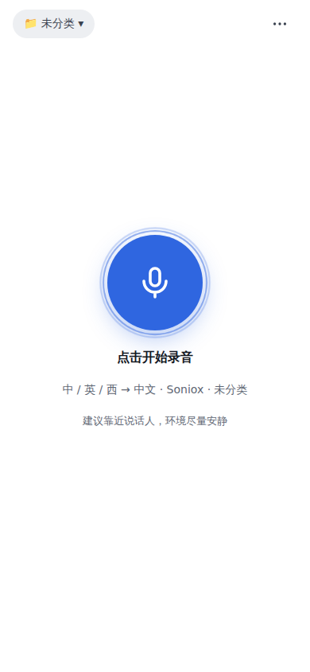
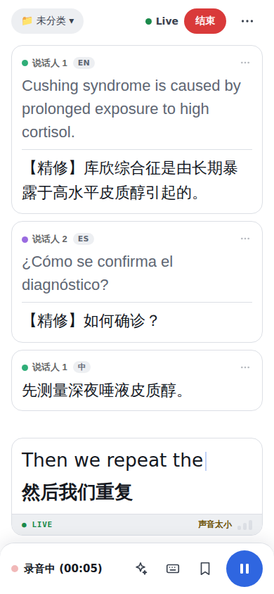
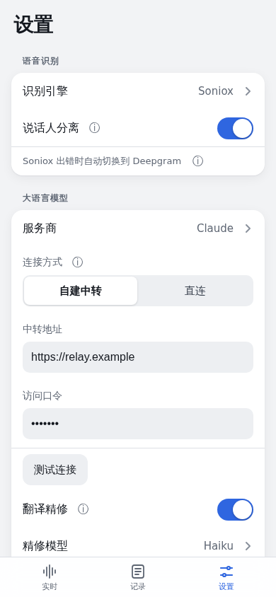

# 同声字幕

手机网页版实时字幕：听中文、英文、西班牙语，实时显示译文（英文、西语 → 中文，中文可选译为英文）。纯 HTML/CSS/JS，单文件 `index.html`，无构建步骤，用 GitHub Pages 部署。

| 未录音 | 录音中 | 设置 |
|---|---|---|
|  |  |  |

## 主要功能

- **实时识别 + 翻译**：默认 Soniox（自动识别中 / 英 / 西，内置实时翻译），出错时自动切换到 Deepgram；也可选浏览器自带识别。
- **翻译精修**：后台用你选的大语言模型（Claude / DeepSeek / OpenAI）结合上下文和术语校对。
- **说话人分离**、**场景与术语**、字号与显示方式、深色模式。
- **记录**：字幕和录音自动保存在手机本地，标签、文件夹、自动摘要、点句跳播、导出（录音 / SRT / Markdown / 备份）。
- **OneDrive 同步**（可选）：录音和全部记录在 iPhone 与电脑之间自动同步。

## 快速开始

1. **部署页面**：仓库 Settings → Pages，选择分支，用 https 网址打开。
2. **部署中转（推荐）**：把 `worker/worker.js` 部署到 Cloudflare Workers，添加 Secret `ACCESS_TOKEN` 和要用的服务商密钥（如 `SONIOX_API_KEY`、`ANTHROPIC_API_KEY`）。
3. **在页面里设置**：右上角「⋯」→ 设置 → 大语言模型 → 连接方式选「自建中转」，填中转地址和访问口令，点「测试连接」。
4. 回到主页，点中间的大按钮开始录音。

不想部署中转时，也可以「直连」：只填 Claude 和 Deepgram 的密钥（这种方式不能用 Soniox 和 OneDrive 同步）。

## 文档

- [功能说明](docs/features.md)：界面、多语言识别、引擎切换与自动备用、翻译精修、记录与摘要、设置迁移
- [部署与配置](docs/setup.md)：获取密钥、费用参考、Cloudflare Worker 中转、接口说明、使用注意
- [OneDrive 同步](docs/onedrive.md)：设计与同步规则、Azure 应用注册、KV 配置
- [手动测试清单](docs/testing.md)
