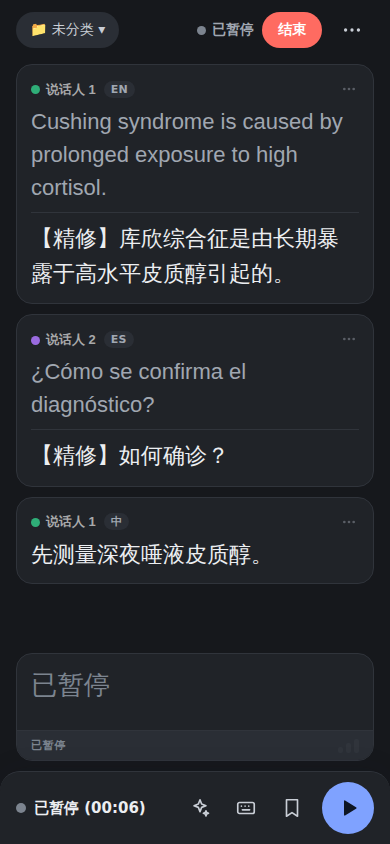
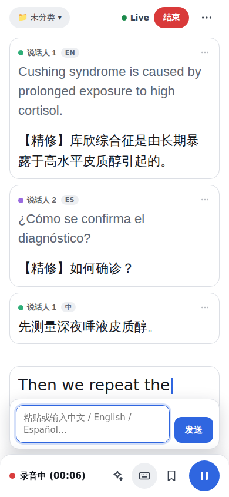
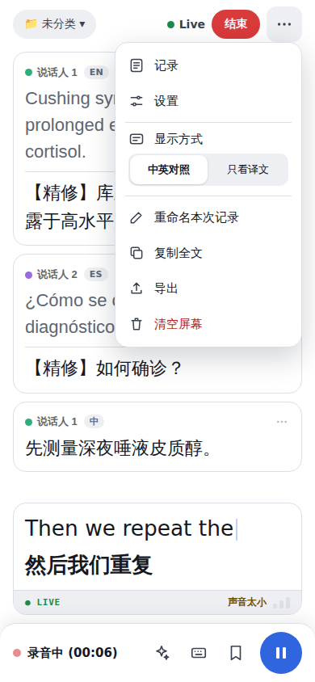
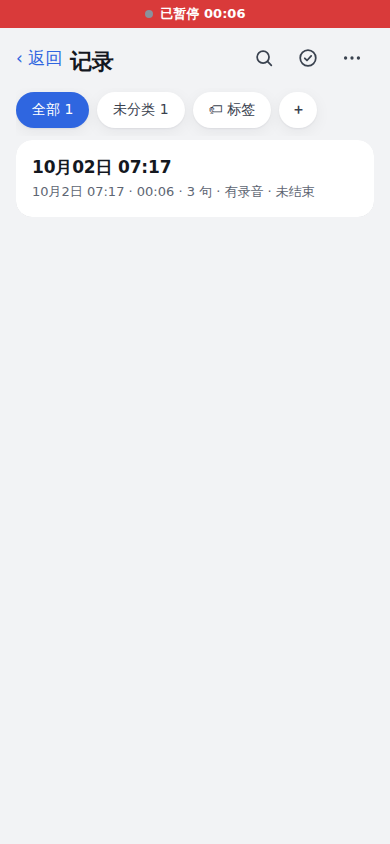
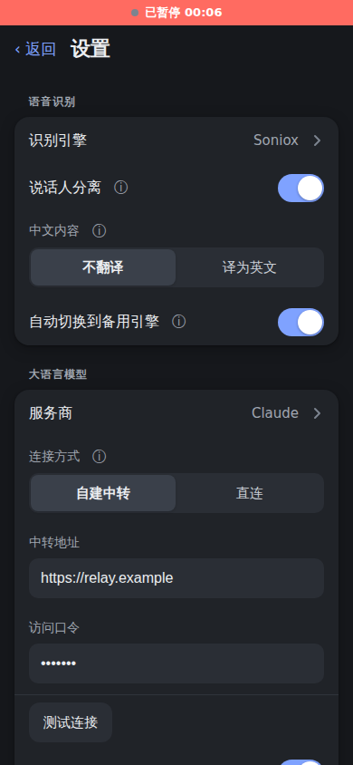

# 同声字幕（英译中实时字幕）

手机网页版工具：听英文，实时显示中文字幕。纯 HTML/CSS/JS，单文件 `index.html`，无构建步骤，可直接用 GitHub Pages 部署。

## 界面

没有底部标签栏：**打开应用就是实时页（主页）**。右上角「⋯」弹出菜单（记录、设置、显示方式「中英对照 / 只看译文」，录音中或屏幕上有字幕时还有重命名本次记录、复制全文、导出、清空屏幕）。「记录」和「设置」从主页推入成独立页面，左上角「‹ 返回」返回；Android 的返回键、iPhone Safari 的边缘返回手势、主屏幕网页里从屏幕左边缘向右滑都可以返回（记录详情 → 记录列表 → 主页，一层一层退）。**录音进行中也可以打开记录和设置，录音在后台继续**，页面顶部会有一条细的红色「● 录音中 07:10」横条，点它回到主页。

| 未录音 | 录音中 | 暂停 | 打字 | ⋯ 菜单 |
|---|---|---|---|---|
|  |  |  |  |  |

| 录音中打开记录（红条） | 设置 | 设置（深色） |
|---|---|---|
|  |  |  |

- **未录音**：页面中央只有一个大号圆形录音按钮（带缓慢的呼吸光晕），下面是「点击开始录音」和设置摘要（如「中 / 英 / 西 → 中文 · Soniox · 未分类」，点它进设置）；还没有任何记录时多一行「建议靠近说话人，环境尽量安静」。左上角是文件夹选择器（开始前选存入哪个文件夹）。结束录音后，这里会显示摘要生成进度（「正在生成摘要…」→「摘要已生成 · 查看」）；也可以在设置 → 录音与存储 →「结束录音后」改成直接打开这条记录。
- **录音中**：点录音后大按钮缩小消失，字幕区展开、底部工具栏升起。顶部右侧是绿点「Live」（暂停时变灰「已暂停」）、红色「结束」（会先确认，然后自动保存）和「⋯」。底部工具栏（圆角顶部，适配底部安全区）：左边「● 录音中 (07:10)」，右边依次是 AI 阶段摘要、打字输入（输入框浮在工具栏上方，发送或点空白处收起）、标记（打「重点」标签并轻微震动）、暂停 / 继续（最大的按钮）。**暂停**会停止发送音频并断开识别连接（Soniox 按连接时长计费，所以直接断开而不是保活），时长停止计时，继续时接在同一条记录后面，字幕里插入「[暂停 mm:ss]」。
- **字幕卡片**：每句一张圆角卡片：说话人色点 + 名称 + 语言标记（中 / EN / ES）+ 右侧「…」；原文（灰色）、分隔线、译文；没有译文的卡片（如中文且不翻译）只显示原文一行（正文颜色，没有分隔线）。长按卡片或点「…」：标记、打标签、复制、修改说话人。
- **「正在说」卡片**：固定在字幕列表下方、工具栏上方，字号约 1.2 倍，原文带闪烁光标、译文加粗；底部信息栏左边「● LIVE」，右边三格收音强度（音量持续过低时提示「声音太小」，暂停时显示「已暂停」）。一句确定后，内容淡入落入上方的普通卡片。
- **滚动**：新句子出现时自动滚到底；向上翻看时停止自动滚动，并出现「↓ 回到最新」。
- **设置页**：开关用 iOS 风格的 toggle，两三个选项用分段控件（连接方式、中文内容、显示方式、外观、结束录音后），选项较多的是整行列表项（左侧名称、右侧当前值），点开从底部弹出选择面板；较长的说明收进「ⓘ」点击展开。
- **条件显示**：「说话人分离」只在识别引擎为 Soniox 时显示；「说话人的口音」只在 Deepgram / 浏览器自带时显示；选 Soniox 但连接方式不是「自建中转」时，识别引擎下方会出现提示和「去设置连接方式」按钮；「翻译精修」只对 Soniox 有意义，其他引擎下隐藏，「精修模型」会自动改叫「翻译模型」（此时它负责全部翻译）。
- **随所选模型变化的文案**：翻译精修、备用引擎、场景与术语的说明里出现的模型名，跟「大语言模型 → 服务商」的选择一致（例如「由 DeepSeek 校对」）。
- 无障碍：可点区域不小于 44px，图标按钮都有文字标签，遵守系统「减少动态效果」设置。

## 设置项改名与迁移

这一版把设置重新分组，并给三个设置改了名。已经保存在浏览器里的旧设置会自动迁移，**值不变**，不需要重新选：

| 旧名称（localStorage 键 `lt-settings` 里的字段） | 新名称 |
|---|---|
| 翻译服务商（`provider`） | 大语言模型 →「服务商」（`llm`） |
| 翻译通道（`route`） | 大语言模型 →「连接方式」（`connection`） |
| 翻译模型（`model`） | 大语言模型 →「精修模型」（`refineModel`；识别引擎不是 Soniox 时显示为「翻译模型」） |

迁移发生在页面启动、读取设置时：旧键的值复制到新键，旧键删除并立即写回；如果新旧键同时存在，以新键为准。其余设置（识别引擎、说话人分离、翻译精修、字号、场景与术语、保存录音、口音、显示方式、摘要模型等）的键和值都不变。新增的设置：「外观」（`theme`，默认跟随系统）、「调试模式」（`debug`，默认关）。

## 功能

- **语音识别 + 翻译**：默认用 **Soniox** 实时识别，并直接使用 Soniox 内置的实时翻译（英文 → 简体中文），一条流里同时出来英文和中文，延迟最低。设置里的「识别引擎」可选 **Soniox（默认）/ Deepgram（备用）/ 浏览器自带（免费备用）**。Soniox 的密钥只放在 Cloudflare Worker 里，手机上不保存，所以使用它需要先部署「自建中转」。**Soniox 出问题时会自动切换到 Deepgram**（见下文「引擎切换与自动备用」）。
- **翻译精修**（默认开）：字幕先按 Soniox 的译文显示，后台再让 Claude 结合前 3 句、「场景与术语」校对识别错误和译文，几秒内有改动就平滑替换。
- **说话人分离**：Soniox 区分不同说话人，字幕前显示彩色圆点和「说话人 N」，可在记录详情里改名。
- **翻译**：Soniox 模式下由 Soniox 内置翻译完成；Deepgram / 浏览器自带模式下用 Claude API 流式翻译（带前 3 句上下文），也可通过自建 Worker 中转切换 DeepSeek / OpenAI。摘要、标题、翻译精修始终用 Claude 等你选的模型。
- **记录**：自动保存字幕和录音、标签、自动摘要、导出与备份（见下文「记录、录音、标签与摘要」）。
- 中英对照 / 只看译文（实时页「⋯」菜单里切换）、字号调节、复制全文 / 导出 / 清空屏幕字幕（实时页「⋯」菜单）、屏幕常亮、打字输入（自动识别中文 / 英文 / 西班牙语）。
- **场景与术语**：里面的内容会作为 Soniox 的 `context`（包括按行提取的术语对照，如 `Cushing syndrome = 库欣综合征`，会同时作为翻译术语表）；也会连同本次会话的标签、所在文件夹名一起提供，提高专业词汇识别和翻译准确度；Deepgram 模式用其中的英文词作 `keyterm`；整段文字也交给 Claude 作翻译/精修参考。
- **口音**：美式 / 英式 / 澳式 / 印度英语，决定 Deepgram 和浏览器自带引擎的识别语言（Soniox 用 `language_hints: ["en"]`，不区分口音）。
- Soniox / Deepgram 模式下顶部状态栏显示已收听时长（mm:ss，累计），方便估算费用。
- 连接意外断开会自动重连（最多 3 次，间隔 1/2/4 秒），状态栏会提示。

## 中文、英文、西班牙语自动识别

用 Soniox 时不用选语言：配置里的 `language_hints` 是 `["zh","en","es"]`，并开启 `enable_language_identification`，每个识别片段都会带上所属语言（字幕卡片上的「中 / EN / ES」标记）。

- **英文、西班牙语 → 中文**：用 Soniox 内置的单向翻译（目标语言中文），翻译精修照常工作，请求时会告诉模型原文语言。
- **中文**：设置 → 语音识别 →「中文内容」：**不翻译**（默认，卡片只显示原文一行）/ **译为英文**（中文句子确定后交给所选的大语言模型翻译成英文，流式显示，不经过 Soniox）。如果 Soniox 对中文句子返回了与原文相同的「译文」，不会显示。
- **切句**：同一句话里语言发生切换时，在切换处分成两张卡片，每张卡片只有一种语言。
- **打字输入**同样自动识别语言（汉字 → 中文；西语特征字符 / 常见词 → 西班牙语；其余按英文），再按上面的规则处理。
- **摘要**统一用中文输出，引用原话时保留原文。
- **数据**：每条字幕记录增加 `language` 字段（`zh` / `en` / `es`）；SRT 里每句前有 `[EN]`、`[说话人 · ES]` 这样的标注，Markdown 里是 `**[00:12]** （ES）**说话人**：…`；旧数据没有这个字段，一律按英文处理。备份导入导出保留语言。
- **备用引擎**：Deepgram / 浏览器自带只识别单一语言（英文）。自动切换到备用引擎时会提示「备用引擎仅识别英文」。

## 获取密钥

Deepgram 和 Claude 的密钥只保存在你手机浏览器的 localStorage 里，不会上传到任何服务器（只会直接发给对应厂商）。**Soniox 例外：它的密钥不放在手机上**，只放在 Cloudflare Worker 的环境变量里（见下文「自建中转层」），手机只保存一个访问口令。

**Soniox（默认识别 + 翻译）**
1. 注册 <https://console.soniox.com>，创建项目后在 API Keys 里生成并复制 API Key。
2. 在控制台的账单（Billing）里充值（Soniox 按用量计费，先充一点即可，余额用完识别会被拒绝，页面会提示「余额不足」并自动切到备用引擎）。具体单价和是否有免费额度以 Soniox 官网为准。
3. 到 Cloudflare Workers 里把它设成环境变量（Secret）`SONIOX_API_KEY`，步骤见「自建中转层」。页面里不需要、也不能填这个密钥。

**Deepgram（备用识别引擎）**
1. 注册 <https://console.deepgram.com>（新用户有免费额度）。
2. 进入 API Keys 创建密钥（权限选 Member 或 Usage 即可），复制。
3. 在本页「设置 → 语音识别 → Deepgram API 密钥」粘贴（走自建中转时改在 Worker 里配 `DEEPGRAM_API_KEY`）。

**Claude**
1. 注册 <https://console.anthropic.com>，充值后在 API Keys 创建密钥（以 `sk-ant-` 开头）。
2. 在「设置 → 大语言模型 → Claude API 密钥」（连接方式选「直连」时出现）粘贴（走自建中转时改在 Worker 里配 `ANTHROPIC_API_KEY`）。

## 费用参考（以官网当前价格为准）

- **Soniox**：按流的时长计费（识别和翻译的单价以 Soniox 官网为准）。注意：连接开着就计费，哪怕没人说话；所以页面在你点「停止」或锁屏中断时会立刻关闭连接，不会用保活消息挂着。
- **Deepgram nova-3 流式**（备用）：按音频时长计费，约 0.0077 美元/分钟（约 0.46 美元/小时）。只有开着麦克风、连接 Deepgram 时才计费，停止后会关闭连接和麦克风。
- **Claude**：Haiku 每句翻译/精修只有几十到一百多个 token，一小时的演讲通常仅几美分；摘要用 Sonnet 更准但更贵。关掉「翻译精修」可以省掉这部分。
- 状态栏的时长 × 单价即可估算识别费用。

## 记录、录音、标签与摘要

每次点麦克风开始 → 停止就是一条「会话」，所有数据只保存在这台手机浏览器的 IndexedDB 里，没有任何后端存储。

- **字幕实时入库**：每确定一句就写入本地数据库，中途刷新或崩溃不丢。下次打开如果发现没有正常结束的记录，会提示「恢复」或「丢弃」。
- **录音存档**（与识别引擎无关，Soniox / Deepgram / 浏览器自带三种都会保存）：Soniox 和 Deepgram 用同一个麦克风流另开 MediaRecorder 录音；浏览器自带引擎自己管麦克风，所以录音会额外单独打开一路麦克风（如果系统不允许同时使用，会提示「没能同时打开录音」，这次只保存字幕，识别不受影响）。录音（优先 webm/opus，其次 mp4、aac；约 32kbps 单声道，约 15MB/小时）（优先 webm/opus，其次 mp4、aac；约 32kbps 单声道，约 15MB/小时），每 10 秒分片写入，意外中断时已录部分不丢；三种引擎的字幕时间轴与录音对齐的方式完全一致。「设置 → 录音与存储 → 保存录音」可关闭。音频与识别互不影响。
- **字幕字号**：英文和中文使用同一个字号（设置里的「字幕字号」滑块），英文颜色略浅以示区分。只有「当前句」放大约 1.3 倍：实时收听时是正在识别的英文预览行和正在翻译的那一句，翻译完成后 300ms 平滑缩回（系统开启「减少动态效果」时不做动画）；回放时是正在播放的那一句。放大缩小时列表不会跳动。「只看中文」模式下，当前句仍显示英文预览，翻译完成后英文才收起。
- **点句跳播**：字幕时间与录音时间轴对齐（Soniox 和 Deepgram 断线重连后都会自动加偏移）。在「记录」里打开会话，点任意一句从该句开始播放，播放时当前句高亮并自动滚动（手动滚动后暂停几秒）；支持倍速 1x/1.25x/1.5x/2x 和后退 15 秒。
- **标签**：
  - 会话标签：详情页顶部添加/删除，输入时自动补全已有标签。
  - 句子标签：点句子右下角的「…」或长按，选预设（重点/作业/考试/没听懂）或自定义；带标签的句子有彩色小块。
  - 收听时点底部「标记」：给最近一句（或正在识别的那句确定后）打上第一个预设标签，并轻微震动。
  - 「设置 → 录音与存储 → 标签管理」可新增预设、改名、删除，改动同步到所有会话。
- **记录页**：顶部只有两行——第一行是大标题「记录」和三个图标按钮：搜索（点开后标题栏变成搜索框，带「取消」；搜索时下面会出现标签筛选胶囊）、选择（多选模式）、「…」（排序方式，默认最新优先；也可以长按「全部」胶囊）；第二行是横向滚动的文件夹胶囊（全部 / 未分类 / 各文件夹，数量显示在胶囊上），末尾是「🏷 标签」（进入「按标签查看句子」，跨会话列出带某标签的句子，点击跳到对应位置）和「＋」新建文件夹。「最近删除」「管理文件夹」只在设置页里有入口（长按文件夹胶囊也能进管理）；另外在多选模式的底部操作栏和空状态里有「最近删除」文字链接，方便找回误删的内容。
- **自动摘要**：停止后字幕超过 10 句会在后台自动生成；详情页也能手动生成/重新生成。摘要走和翻译相同的通道（中转或直连），使用可单独选择的更强模型（默认 Sonnet），不占用实时翻译。输出为中文 Markdown：一句话概括、主要内容（带时间点）、关键术语、作业/待办/截止日期、标记内容回顾；摘要里的 `[mm:ss]` 可点击跳转。原文超过约 6 万字符时先分段整理再合并。
- **自动标题**：会话开始先用临时标题「MM月DD日 HH:mm」；累计约 15 句后，用快速模型（就是翻译用的模型，走同一通道，不占用摘要模型）生成不超过 15 个字的中文标题。停止后生成摘要时，同一次调用会顺带返回最终标题，直接替换；解析失败则保留原标题。你手动改过标题后会标记为「已编辑」，之后不再被自动覆盖。详情页标题旁有「重新生成标题」按钮（点了就以新标题为准）。
- **文件夹**：一层文件夹，用来归档（如课程名）；一个记录只属于一个文件夹，但可以有多个标签（用来标记内容）。「记录」页顶部是文件夹栏：全部 / 未分类 / 各文件夹 / 「＋」新建。「管理文件夹」（或长按文件夹）里可重命名、删除、拖动 ☰ 排序；删除文件夹时可选「记录移到未分类」或「连同记录一起删除」（记录先进「最近删除」）。开始新会话前，在收听页右下方「📁 存入：…」选择文件夹，默认沿用上次的选择。
- **移动与删除**：记录列表里向左滑动露出「移动」「删除」（也可以长按弹出菜单）；右上角「选择」进入多选，可全选，底部有「移动到…」和「删除」，「移动到…」里可直接新建文件夹；详情页「更多」菜单里也有「移动到文件夹」和「删除」。
- **最近删除**：删除的记录先放进「最近删除」（类似 iPhone 相册），保留 30 天，每次打开应用时自动清除过期的。可以恢复（回到原文件夹，文件夹已删除则放入未分类）或立即永久删除；永久删除会一并删掉字幕和音频分片，释放空间。
- **中断续录**：iPhone 锁屏或切到后台时 Safari 会收回麦克风。回到前台会提示「录音已中断，是否继续」，继续则接在同一条记录后面，字幕里插入「[中断 mm:ss]」；中断前后的录音是独立的两段音频，回放时按时间轴自动衔接。
- **说话人**：Soniox 区分说话人时，同一场出现 2 位及以上说话人才显示标签（彩色圆点 + 「说话人 N」，单人讲课不会每句都带）。详情页「更多 → 重命名说话人」可以按会话改名（如「王老师」），实时字幕和详情同步更新；SRT、Markdown 和摘要的输入文本都会带上说话人名字，备份里保存 `speaker` 和说话人名称；没有说话人字段的旧数据照常显示。设置里可以关掉「说话人分离」。
- **导出与备份**（会话详情 → 导出）：录音文件（.webm / .m4a，续录的多段分别导出）、字幕 SRT（中英双语）、笔记 Markdown（标题、标签、摘要、带时间戳的双语全文）、完整备份 JSON（不含音频）。设置页可「导出全部备份」和「导入备份」。备份 JSON 现为 v2 格式，包含文件夹信息；旧版（v1）备份没有文件夹字段，导入时记录会放入「未分类」。iPhone 上优先弹出系统分享面板，可直接存到「文件」或 iCloud。

**存储注意**
- 设置 → 录音与存储显示已用空间和可用空间。首次开始时会向浏览器申请持久化存储，但不保证一定通过；没通过时这里会写「数据可能被系统清理」，旁边有「开启保护」按钮可以再试一次（成功后显示「已开启保护 ✓」；iPhone 上失败会提示「添加到主屏幕后使用更安全」）。
- **iPhone Safari 有约 7 天清理风险**：网站长期（约 7 天）不打开，系统可能清除它的本地数据（包括所有录音和记录）。建议「添加到主屏幕」使用（主屏幕网页一般不受这个规则影响），并定期导出备份。
- 清除浏览器网站数据、无痕模式都会丢失记录。

## 手动测试清单（麦克风相关功能无法在云端自动测试）

在真机（iPhone Safari 和安卓 Chrome 各做一遍）：

1. **录音（三种引擎各做一遍）**：设置里依次选 Soniox、Deepgram、浏览器自带，保持「保存录音」打开，各收听约 1 分钟再停止 → 「记录」里出现新会话，标注「有录音」，时长正确；打开后点播放能听到声音。关掉「保存录音」再录一次，详情页应提示没有录音。浏览器自带引擎在 iPhone 上需要特别留意：它的识别和录音同时用麦克风，如果出现「没能同时打开录音」，说明系统不允许，这次只保存字幕。
2. **跳播**：在详情页点第 3 句 → 从该句开始播放；播放中当前句高亮并滚动；手动上下滑动后自动滚动暂停几秒再恢复；试倍速和「后退 15 秒」，拖动进度条。
3. **打标签**：收听时点工具栏的「标记」（手机应轻微震动）；点句子右上角的「…」选「打标签」加「考试」；长按另一句选「打标签」加自定义标签；给会话加标签并试自动补全；到设置里给标签改名/删除，检查各处同步。「记录」页试筛选、搜索和「按标签查看句子」。
4. **摘要**：录到超过 10 句后停止，过几秒摘要自动出现；点摘要里的时间点能跳到对应位置；手动「重新生成」；故意填错密钥试一次，应显示错误和「重试」。
5. **导出**：依次导出录音、SRT、Markdown、备份 JSON；iPhone 上应弹分享面板。删掉会话后从设置里「导入备份」，字幕、标签、摘要应恢复（没有音频）。
6. **崩溃恢复**：收听中说几句，直接关闭标签页或强制刷新，再打开 → 应提示「发现未完成的记录」，点「恢复」后在「记录」里能看到已保存的字幕和已录部分。
7. **中断续录**：收听中锁屏 10 秒以上再解锁（或切到别的 App 再回来）→ 应提示「录音已中断」；点「继续录音」后接在同一会话后面，字幕里有「[中断 mm:ss]」，回放能跨过中断点。
8. **字号变化**：设置里拖动「字幕字号」，实时字幕和记录详情里的英文、中文应一样大。收听时，正在识别的英文预览行和正在翻译的那一句应比普通字幕大一圈，翻译完成后平滑缩回，同时上面已经看过的句子位置不动；打开「只看中文」，当前句应先显示英文、翻译完成后英文收起。回放时，正在播放的那一句放大高亮，滚动页面时高亮句位置稳定，停手几秒后自动滚回来。
9. **自动标题**：录音超过约 15 句，标题应从「MM月DD日 HH:mm」变成一个中文主题标题；停止后摘要生成完标题可能再更新一次。手动重命名后再重新生成摘要，标题不应被覆盖；点「重新生成标题」应得到新标题。
10. **文件夹**：在收听页选一个文件夹再录一条，记录页应出现在该文件夹里；试新建、重命名、拖动排序、两种删除方式。
11. **移动**：单条左滑「移动」；长按菜单；「选择」多选后「移动到…」（含在里面新建文件夹）；详情页「更多 → 移动到文件夹」。
12. **删除与恢复**：删除后到「最近删除」应能看到剩余天数，可以恢复回原文件夹，也可以永久删除（存储用量应下降）。想验证 30 天自动清除，可以在电脑上用浏览器开发者工具把某条记录的 `deletedAt` 改成 31 天前，刷新页面后它应被清掉。
13. **Soniox 基本识别与翻译**：部署好中转并配好 `SONIOX_API_KEY` 后，识别引擎选 Soniox，点麦克风 → 状态栏出现「连接中…」然后「收听中 mm:ss」；对着手机说英文，预览行同时出现英文和中文（当前句放大），说完一句后落成带标点的英文 + 中文，且中英文一一对应。在「场景与术语」里写 `Cushing syndrome = 库欣综合征` 这类对照，说到这些词时识别和译法应更准。
14. **噪音环境**：在有背景噪音（咖啡馆、街边、开着电视）的地方说话，对比 Soniox / Deepgram / 浏览器自带的准确度；噪音下不应不停冒出乱码句子。
15. **快语速**：用 1.5 倍速播放一段英文讲座，字幕应能跟上，不应大段丢词；一句话结束后译文及时出现。
16. **长句切分**：连续说很长的一段话（不停顿超过十几秒、超过 25 个词），应在标点处分批出现，不应等到整段说完才出；拼起来不丢词、不重复，每批的中英文对应。
17. **多人说话**：两三个人轮流说话（或播放有多人对话的视频），字幕前应出现不同颜色的「说话人 1/2/3」；在详情页「更多 → 重命名说话人」改名后，实时字幕和详情同步更新；导出的 SRT / Markdown 带名字；设置里关掉「说话人分离」后不再出现标签。
18. **断线重连**：收听中关掉手机网络（开飞行模式）几秒再打开 → 状态栏显示「重连中（1/3）」，网络恢复后自动回到「收听中」，新说的句子点句跳播仍然对齐；断线时没说完的那句不丢。
19. **自动切换备用引擎**：把 Worker 里的 `SONIOX_API_KEY` 改成错的（或让余额用完），点麦克风 → 应自动切到 Deepgram，状态栏显示「已切换到备用引擎」，字幕里有「[已切换识别引擎]」，译文由 Claude 给出；之后同一个会话里的时间轴和点句跳播仍连续。再试：收听中一直开着飞行模式，重连 3 次失败后也应切换。
20. **翻译精修**：说几句带专业词的话（故意让 Soniox 认错一个词），几秒内对应的句子应被悄悄改正；关掉「翻译精修」后应不再变化；把网络弄慢，超过 8 秒没回来的句子保持原样、没有报错。
21. **停止不再计费**：点停止后状态栏停在「已暂停」，到 Soniox 控制台确认没有还在进行的流；最后一句没说完的话应作为最后一句送出（停止后最多等约 5 秒）。
22. **错误提示**：把页面里的访问口令改错，应提示「中转访问口令无效」；Worker 里没配 `SONIOX_API_KEY` 应提示去配置（没有备用引擎时）；拒绝麦克风权限应提示权限被拒绝。
23. **设置页分组与条件显示**：点「⋯」→「设置」。识别引擎选 Soniox → 应看到「说话人分离」，看不到「说话人的口音」；换成 Deepgram 或浏览器自带 → 相反，且「翻译精修」隐藏、「精修模型」改叫「翻译模型」；连接方式选「直连」且引擎为 Soniox → 识别引擎下方出现提示，点「去设置连接方式」应滚动并高亮「连接方式」。
24. **文案跟随模型**：服务商换成 DeepSeek，「翻译精修」的ⓘ说明、备用引擎说明、场景与术语下面的小字里应写「DeepSeek」；换成 OpenAI 同理。
25. **测试连接**：填好中转后点「测试连接」→ 绿色对勾和毫秒数；把访问口令改错再点 → 红色失败原因。
26. **设置迁移**：升级前已保存过设置的浏览器，打开新版后服务商、连接方式、模型的选择都应保持不变（没有被重置成默认值）。
27. **深色 / 浅色**：设置 → 显示 → 外观，依次选「跟随系统」「浅色」「深色」；再用系统的深色模式切换验证「跟随系统」。各页面文字清晰、没有刺眼的纯黑或纯白块。
28. **底部安全区**：iPhone（带底部横条的机型，Safari 和「添加到主屏幕」两种方式）和安卓手势导航机型上，底部工具栏不被横条遮挡，按钮都容易点到；输入法弹出时工具栏不乱跳。
29. **收音强度与动效**：收听时「正在说」卡片右下角的三格随说话声音大小点亮，停止或暂停后熄灭；系统打开「减少动态效果」后，页面切换、弹出面板、呼吸红点等动画应基本消失。
30. **加载与空状态**：新装（没有记录）时「记录」页应显示图标插图和一句引导；有较多记录时刷新页面，记录页应先出现灰色骨架卡片，再出现真实内容；设置页的存储用量先是灰色占位条。
31. **长按字幕菜单**：收听时长按任意一句字幕（或点它右上角淡淡的「…」）→ 弹出菜单：「打标签」「复制」，多人说话时还有「修改说话人」（可改成已有的某位、新建一位，或重命名当前说话人）；没有标签的句子下面不应再出现单独一行的「…」。
32. **记录页顶部**：只有「记录」标题 + 搜索 / 选择 / 「…」三个图标和一行文件夹胶囊（末尾有「🏷 标签」和「＋」）。点放大镜 → 标题栏变成搜索框并弹出键盘，输入能筛选，「取消」恢复；点「…」或长按「全部」能选排序方式；点「🏷 标签」进入按标签查看句子；页面上不应再有「最近删除」「管理文件夹」按钮和「共 N 条」；进入「选择」后底部操作栏里有「最近删除」链接，没有记录时空状态里也有。
33. **首次使用提示**：全新安装（还没有任何记录）时，大录音按钮下面有「建议靠近说话人，环境尽量安静」；录完第一条记录后这行字不再出现；录音中的状态信息（重连、「已切换到备用引擎（仅识别英文）」等）显示在「正在说」卡片上方，没有状态时不占空间。
34. **打字浮层**：点工具栏的打字按钮，输入框以浮层出现在工具栏上方，字幕区保持可见（iPhone SE 等小屏、弹出键盘时也看一下）；输入框获得焦点时是 1.5px 主色边框加柔和外发光，没有双层粗边框；「发送」按钮文字垂直居中。
35. **设置页微调**：识别引擎为 Soniox 时有「自动切换到备用引擎」开关，关掉后把 Worker 里的 `SONIOX_API_KEY` 改错 → 只提示错误、不切换；「高级」里直接就是「调试模式」开关；存储空间显示「数据可能被系统清理」和「开启保护」按钮，点击后成功显示「已开启保护 ✓」（iPhone 上失败提示「添加到主屏幕后使用更安全」）；Soniox 没走自建中转时的警告是浅色背景，里面是蓝色的「去设置 →」文字链接，不是实心深色按钮。
36. **深色模式和安全区**：以上改动在浅色、深色下都清晰；iPhone 底部横条处标签栏、多选模式的底部操作栏不被遮挡。
37. **没有标签栏的导航**：打开应用直接是实时页；点「⋯」→「记录」「设置」，页面从右侧推入，左上角「‹ 返回」能退回主页；在记录里打开一条详情 → 返回回到记录列表 → 再返回回到主页；Android 返回键同样；iPhone 主屏幕网页里从屏幕最左边缘向右滑动能返回（Safari 里用系统自带的边缘手势）。
38. **录音中开页面**：录音（或暂停）时打开记录或设置，录音和字幕在后台继续；页面顶部出现红色「● 录音中 07:10」横条，点它回到主页；回到主页后字幕没有丢，时间连续。
39. **三种状态与结束确认**：未录音时只有中央大按钮、「点击开始录音」和设置摘要（点摘要进设置）；点按钮后大按钮缩小消失、字幕区和底部工具栏出现（系统开启「减少动态效果」时动画应基本消失）；点工具栏的暂停 → 顶部变灰「已暂停」、计时停止、「正在说」卡片显示「已暂停」，Soniox 控制台里连接已断开；点继续 → 恢复并出现「[暂停 mm:ss]」；点顶部「结束」→ 先确认，确认后回到未录音状态并显示摘要生成进度（句子超过 10 句才有摘要）；把设置里「结束录音后」改成「打开这条记录」再试一次。
40. **底部工具栏**：AI 按钮给出到目前为止的阶段摘要（中文，引用保留原文）；打字按钮弹出浮层输入框，发送或点空白处收起，打中文 / English / Español 都能被正确识别并翻译；标记按钮给最近一句打「重点」并轻微震动；长按任意字幕卡片弹出菜单（标记、打标签、复制、修改说话人）。
41. **中、英、西混说**：依次用中文、英文、西班牙语各说几句，再在一句话里切换语言（如「We say buenas noches」）：每张卡片只有一种语言并带「中 / EN / ES」标记，语言切换处被切成两张卡片；英文、西语有中文译文，中文句子只显示原文（「中文内容」为「不翻译」）。
42. **「中文内容」选项**：设置里把「中文内容」改成「译为英文」，再说中文 → 句子下面出现流式的英文译文；改回「不翻译」后中文句子只有一行原文。
43. **回到最新与收音强度**：句子足够多后向上翻看，应停止自动滚动并出现「↓ 回到最新」，点它回到底部；「正在说」卡片右下角三格随音量点亮，对着手机不说话几秒后提示「声音太小」。
44. **深色模式与安全区**：主页、菜单、字幕卡片、工具栏在深色下都清晰，说话人颜色柔和可辨；iPhone 的顶部刘海 / 灵动岛和底部横条处，顶部栏、红色横条和底部工具栏都不被遮挡。

## 自建中转层（可选，Cloudflare Workers）

不想在手机上保存各家密钥，或想随意切换 Claude / DeepSeek / OpenAI 时，可以部署 `worker/worker.js`。密钥全部存在 Worker 里，手机只保存一个访问口令；Deepgram 由 Worker 签发短期令牌。Workers 免费额度每天 10 万次请求，个人使用基本免费。

**部署（网页方式，不用装工具）**
1. 注册 <https://dash.cloudflare.com>，进入 Workers & Pages → Create → Create Worker，随便起个名字部署。
2. 点 Edit code，把 `worker/worker.js` 的内容整个粘贴进去覆盖，Deploy。
3. 在 Worker 的 Settings → Variables and Secrets 里添加 Secret：
   - `ACCESS_TOKEN`：自己编一串足够长的随机口令（必填）
   - `ANTHROPIC_API_KEY` / `DEEPSEEK_API_KEY` / `OPENAI_API_KEY`：用到哪家填哪家
   - `DEEPGRAM_API_KEY`：需要 Member 及以上权限（签发临时令牌用）
   - 可选变量 `ALLOWED_ORIGIN`，例如 `https://ruqinga.github.io`，限制只有你的页面能调用
4. 复制 Worker 网址（`https://xxx.workers.dev`）。

**Soniox 需要的环境变量**：在同一个位置再添加 Secret `SONIOX_API_KEY`（Soniox 控制台里的 API Key），添加后重新部署 Worker。页面向 Worker 的 `/soniox-token` 要一个 60 秒内有效、只能用于实时 WebSocket 的临时 key，再用它连接 Soniox（**真正的 API Key 不会下发到浏览器**）。没有配置时 Worker 会返回明确的中文提示，页面也会提示并自动切到备用引擎。

也可用命令行：`cd worker && npx wrangler deploy`，再用 `npx wrangler secret put ACCESS_TOKEN` 等命令设置密钥。

**在页面里使用**：设置 → 大语言模型 → 连接方式选「自建中转」，填入中转地址和访问口令，再选服务商和模型即可；点「测试连接」会发一个极短请求，成功显示绿色对勾和响应时间，失败显示原因。此时不需要再填 Claude / Deepgram 密钥。

**接口**（新版增加了 `/summary`，已部署过旧版 Worker 的需要更新代码并重新部署，否则摘要会提示「中转层还不支持摘要」；用 Cloudflare 的 Git 集成部署的话，合并到 main 后会自动更新）
- `POST /summary`：同 `/translate`，但允许更长的输入（约 20 万字符）和输出（4096 tokens），并支持 `claude-opus-5-5`。
- `POST /translate`：body 为 `{provider, model, system, user}`，返回统一的流式格式 `data: {"t":"文本"}`，结束为 `data: [DONE]`。
- `GET /deepgram-token`：返回 `{access_token, expires_in}`，页面用 `new WebSocket(url, ["bearer", access_token])` 连接。
- `GET /soniox-token`（新）：用 `SONIOX_API_KEY` 向 Soniox 换取临时 API key（有效期 60 秒，用途限定为实时 WebSocket），返回 `{token, expires_in_seconds}`；页面把它放进 WebSocket 第一条配置消息的 `api_key` 里。未配置 `SONIOX_API_KEY` 时返回 500 和中文提示。已部署过旧版 Worker 的需要更新代码并重新部署，否则页面会提示「中转层还不支持 Soniox」。
- 所有请求都要带 `Authorization: Bearer <ACCESS_TOKEN>`。服务商和模型有白名单，想加新模型改 `worker.js` 顶部的 `PROVIDERS`，同时在 `index.html` 的 `MODELS` 里加上。

**排错**：页面提示「中转访问口令无效」（401）时，先到 Worker 的 Settings → Variables and Secrets 确认 `ACCESS_TOKEN` 还在，并且和页面设置里的「访问口令」完全一致。Git 集成部署时，后台添加的普通变量（Text 类型）可能在重新部署后被清掉；添加密钥请选 **Secret** 类型，`wrangler.toml` 里也已加了 `keep_vars = true`。可以用下面的命令验证（应返回 200 和译文，而不是 401）：

```
curl -i -X POST https://你的Worker网址/translate -H "Authorization: Bearer 你的ACCESS_TOKEN" -H "Content-Type: application/json" -d '{"provider":"deepseek","system":"翻译成中文","user":"hello"}'
```

**注意**：访问口令一旦泄露，别人就能消耗你的额度，请定期更换，并建议设置 `ALLOWED_ORIGIN`。

## 引擎切换与自动备用

设置 → 语音识别 → 识别引擎：
- **Soniox（默认）**：要求「连接方式」已选「自建中转」并填好中转地址和访问口令，Worker 里配好 `SONIOX_API_KEY`。
- **Deepgram（备用）**：可直连（在页面里填 Deepgram 密钥），也可走中转（Worker 里配 `DEEPGRAM_API_KEY`）。此时翻译由 Claude 完成。
- **浏览器自带**：不需要任何识别密钥，准确度较低。

**自动备用**（设置 → 语音识别 →「自动切换到备用引擎」开关，默认开；关闭后 Soniox 出错只提示，不自动切换）：用 Soniox 收听时，如果取临时 key 失败、连接被拒（密钥无效/余额不足）、或断线后自动重连 3 次仍失败，页面会在同一个会话、同一条时间轴里自动切换到 Deepgram（需要 Deepgram 可用：直连填了密钥，或 Worker 配了 `DEEPGRAM_API_KEY`）：状态栏显示「已切换到备用引擎」，字幕里插入一条「[已切换识别引擎]」分隔线，之后的翻译改由 Claude 完成，录音不中断。没有可用的备用引擎时只显示错误提示。再次点麦克风开始新的收听时，会重新先尝试 Soniox。
- 从旧版本升级的，识别引擎会保持之前的选择；新用户默认是 Soniox。

## 翻译精修

设置 → 大语言模型 →「翻译精修」（默认开，仅 Soniox）。Soniox 的每一句字幕会立刻显示，同时后台把「英文原文 + Soniox 译文 + 前 3 句 + 场景与术语」发给「精修模型」（当前所选大语言模型里的快速模型，如 Claude / DeepSeek / OpenAI），让它修正识别错误（同音词、专有名词）并润色译文。多个请求并行发出，但结果按句子顺序依次应用；有改动就平滑替换，英文被改过时数据库里仍保留原始识别文本（`rawEn`）；请求失败或超过 8 秒就静默放弃，保持 Soniox 的原样。关闭后只显示 Soniox 的译文，也不再消耗 Claude 额度。

## 使用注意

**通用**
- 必须用 **https** 网址打开（GitHub Pages 默认就是），否则浏览器不给麦克风。
- 第一次点麦克风时允许麦克风权限；被拒绝后需在浏览器/系统设置里重新允许并刷新页面。
- 建议靠近说话人、环境安静。

**iPhone**
- 请用 **Safari**（iOS 14.5 及以上）；从主屏幕添加的网页同样可用。
- 音频采集使用 AudioWorklet 输出 16kHz PCM，而不是 MediaRecorder（Safari 录出 mp4，不适合流式识别）。
- 收听时请保持屏幕亮着、页面在前台；锁屏或切到后台，系统会暂停麦克风。
- 「浏览器自带」引擎在 iPhone 上受系统听写限制，效果不如 Soniox / Deepgram。

**安卓**
- 请用 **Chrome**。收听时保持页面在前台，省电模式可能会中断后台音频。
- 用蓝牙耳机时，麦克风可能被切换到耳机，建议使用手机自带麦克风。

## 部署

把 `index.html` 放在仓库根目录，在 GitHub 仓库 Settings → Pages 选择分支即可。
