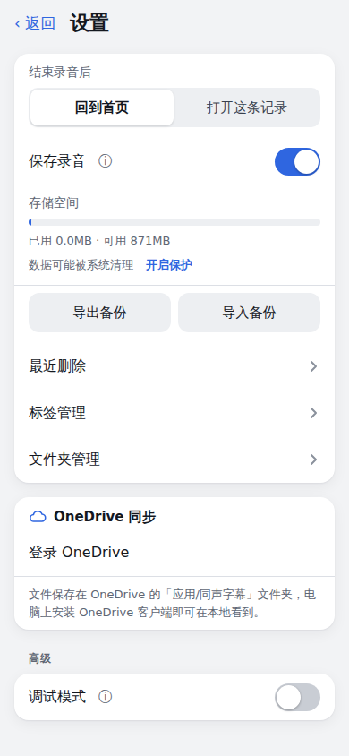
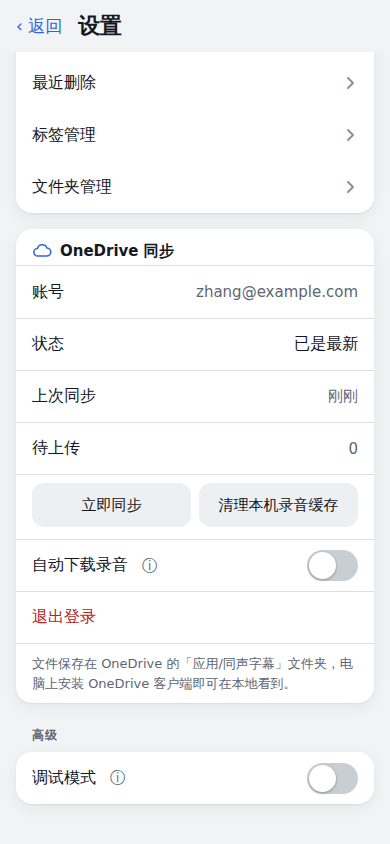
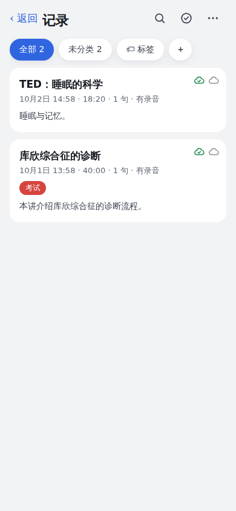

# OneDrive 同步

[← 返回 README](../README.md)

## 概述

登录 OneDrive 后，录音和全部记录数据会在后台同步到你的 OneDrive，iPhone 和电脑之间自动同步；电脑上装了 OneDrive 客户端的话，文件会自动出现在本地文件夹里。**不登录时行为和以前完全一致**（不会发出任何同步请求）。

  

**设计**
- 手机上的 IndexedDB 始终是本地工作区：离线可以录、可以看，同步在后台进行。录音进行中不上传、不同步，结束后自动上传。
- 登录由 Cloudflare Worker 代管：微软的刷新令牌只存在 Worker 的 KV 里，页面拿到的只是短期访问令牌（快过期时自动重新获取），所以 iPhone Safari 不会因为拦截后台续期而频繁要求重新登录。这是单用户应用：一个 Worker 只绑定一个 OneDrive 账号；已经在 Worker 登录的话，另一台设备只需要在设置里点「在这台设备启用同步」。
- 文件内容由页面直接调用 Microsoft Graph 读写，不经过 Worker。只使用 OneDrive 的应用专属文件夹（App Folder），不会访问你的其他文件。

**OneDrive 里的文件**（在 OneDrive 网页或本地客户端的「应用 / 同声字幕」文件夹，名字取决于你在 Azure 里给应用起的名字）

```
sessions/<会话id>/record.json    完整数据：字幕、时间戳、说话人、语言、标签、摘要、文件夹、updatedAt、deletedAt（带 schemaVersion）
sessions/<会话id>/audio.webm      录音（iPhone 上是 audio.m4a；中断 / 暂停续录的多段是 audio-p1.webm、audio-p2.webm…）
readable/<文件夹名>/<YYYY-MM-DD 标题>/notes.md、subtitles.srt   给人直接看的笔记和字幕（只写不读）
_meta/folders.json、tags.json、settings.json                    文件夹、标签预设、非敏感设置（绝不包含任何密钥、口令、连接地址）
```

同步只依据 `sessions/` 和 `_meta/`；`readable/` 由 `record.json` 生成（沿用现有的 Markdown / SRT 导出），记录改名、移动文件夹、删除时对应的 readable 文件会跟着更新或删除。文件名里的非法字符会替换掉，重名时追加短 id。

**同步规则**
- **上传**：录音结束后自动上传 `record.json`、录音和 readable 文件；改标题、标签、移动、删除等编辑后约 3 秒上传 `record.json`。录音超过 4MB 用上传会话分块上传，中断后从服务器已收到的位置续传。
- **拉取**：打开应用、回到前台、前台每 5 分钟，用 delta 增量查询获取变化，下载其他设备新增或修改的记录并合并（个别账号的 App Folder 不支持 delta 时，自动退回为逐个会话文件夹按 eTag 比对）。
- **录音按需下载**：没有本地录音的设备上，点击播放（或点句子跳播、导出音频）时才从 OneDrive 下载并缓存到本机，显示下载进度；设置里「自动下载录音」默认关。「清理本机录音缓存」只会删除已经在 OneDrive 上有完整副本的本机录音。
- **冲突**：以 `updatedAt` 较新的为准；两边在上次同步后都有修改时，保留两份，另一份标题加「（冲突副本）」，列表里有警告图标，不会静默丢弃。在详情页「更多 → 标记为已处理」可以清除标记。
- **删除**：删除（移入最近删除）会同步到其他设备，对方也移入最近删除；30 天后彻底删除时，同时删除 OneDrive 上的会话文件夹和 readable 文件（OneDrive 回收站还会保留一段时间作为保险）。如果云端的记录被手动删掉而本机还有，会重新上传，不会静默丢数据。
- **失败处理**：进入待上传队列，指数退避重试（最长 5 分钟）；令牌失效时暂停同步，设置里提示重新登录；不会弹窗打断，只在设置的同步状态和记录列表图标上显示。
- **首次登录**：本机已有的数据和 OneDrive 里的数据按 id 合并，完成后提示「上传 N 条、下载 N 条」。旧数据自动补上 `updatedAt` 并标为待上传。
- 注意：各设备用自己的系统时间判断「较新」，请保持手机和电脑的时间正确。

**记录列表里的小图标**：绿色云朵打勾 = 已同步，蓝色云朵向上 = 待上传，红色三角 = 冲突副本；灰色云朵 = 录音在 OneDrive、本机没有。

**设置 → 存储与同步 → OneDrive**：未登录显示「登录 OneDrive」；已登录显示账号邮箱、状态、上次同步时间、待上传数量、「立即同步」、「自动下载录音」、「清理本机录音缓存」和「退出登录」。退出登录会问你：只在这台设备停止同步（其他设备不受影响）；退出登录并保留本机数据（所有设备都停止同步）；退出登录并清除本机已同步的数据（还没上传的会保留）。需要「连接方式」为「自建中转」，并且 Worker 已按下面的步骤配置好。

## OneDrive 的 Azure 应用注册和 Worker 配置

1. 打开 <https://portal.azure.com> → Microsoft Entra ID → 应用注册 → 新注册。名称填「同声字幕」（OneDrive 里的文件夹就叫「应用 / 同声字幕」）；**受支持的账户类型**选「任何组织目录中的账户和个人 Microsoft 账户」；**重定向 URI** 平台选 **Web**，填 `https://<你的Worker地址>/onedrive/callback`（要和 Worker 的实际地址完全一致）。
2. 应用注册 → API 权限 → 添加权限 → Microsoft Graph → **委托的权限**：`Files.ReadWrite.AppFolder`、`offline_access`、`User.Read`（后两个通常默认就有）。
3. 证书和密码 → 新客户端密码，复制它的**值**（只显示一次）。**客户端密码有有效期（最长 24 个月），到期后同步会提示「微软拒绝了应用凭据」，需要重新生成一个并更新 Worker 的 `MS_CLIENT_SECRET`。**
4. 复制应用的「应用程序(客户端) ID」。到 Worker 的 Settings → Variables and Secrets 添加（类型选 **Secret**）：`MS_CLIENT_ID`（应用程序 ID）、`MS_CLIENT_SECRET`（上一步的密码值）。
5. **KV 命名空间**：`worker/wrangler.toml` 里已经声明了绑定 `ONEDRIVE_KV`（存放刷新令牌和账号信息），没写 `id`，Cloudflare 部署时会自动创建并绑定。如果部署日志提示缺少 KV 的 id：到 Cloudflare 后台 Storage & Databases → KV 手动创建命名空间，把它的 id 填进 `wrangler.toml` 的 `[[kv_namespaces]]` 里（`id = "…"`），提交后重新部署。
6. 重新部署 Worker（Git 集成合并到 main 后自动部署；之前部署过的需要更新代码）。回到页面：设置 → 存储与同步 → 登录 OneDrive。
7. 登录完成后，在 OneDrive 网页的「应用」文件夹里找到「同声字幕」；电脑装了 OneDrive 客户端的话，本地的 OneDrive 文件夹里 `应用\同声字幕`（英文系统是 `Apps\同声字幕`）下就能看到 `readable/…/notes.md` 等文件。

注意：`Files.ReadWrite.AppFolder` 在个人 Microsoft 账户上是成熟功能；组织（工作或学校）账户的 App Folder 支持在微软文档里仍标注为预览，可能受管理员策略限制。我没能在真实账号上验证（云端环境访问不了微软文档和账号），个人账号是首选。
